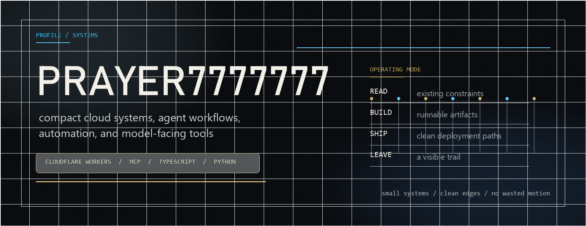
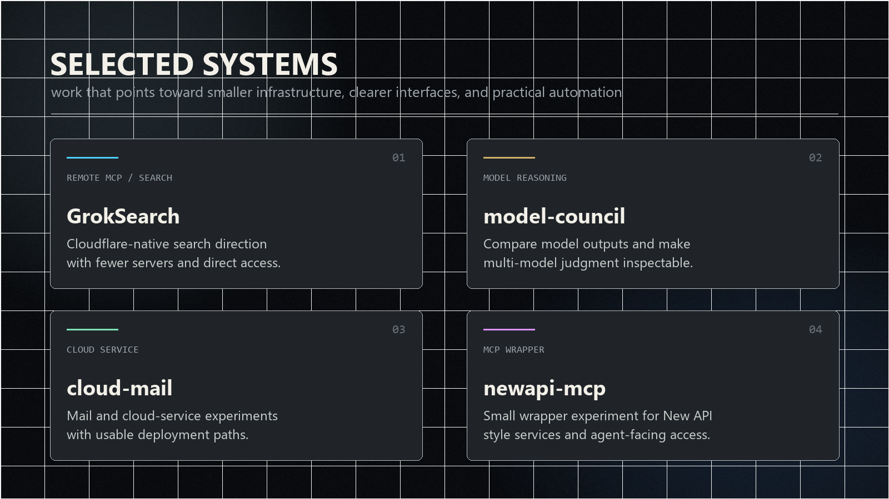
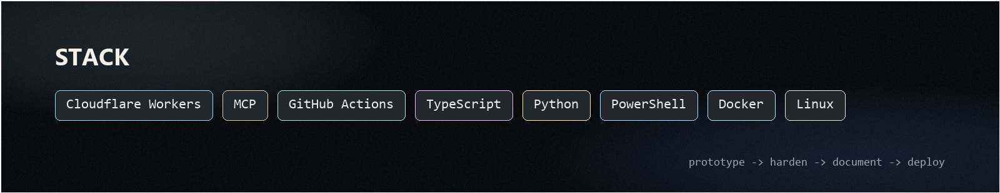

  

  <a href="https://github.com/prayer7777777?tab=repositories">repositories</a>
  &nbsp;&nbsp;/&nbsp;&nbsp;
  <a href="https://github.com/prayer7777777/GrokSearch">GrokSearch</a>
  &nbsp;&nbsp;/&nbsp;&nbsp;
  <a href="https://github.com/prayer7777777/model-council">model-council</a>
  &nbsp;&nbsp;/&nbsp;&nbsp;
  <a href="https://github.com/prayer7777777/newapi-mcp">newapi-mcp</a>
  &nbsp;&nbsp;/&nbsp;&nbsp;
  <a href="https://github.com/prayer7777777/cloud-mail">cloud-mail</a>

 

  

  <a href="https://github.com/prayer7777777/GrokSearch">GrokSearch</a>
  &nbsp;&nbsp;
  <a href="https://github.com/prayer7777777/model-council">model-council</a>
  &nbsp;&nbsp;
  <a href="https://github.com/prayer7777777/cloud-mail">cloud-mail</a>
  &nbsp;&nbsp;
  <a href="https://github.com/prayer7777777/newapi-mcp">newapi-mcp</a>

 

  

  
Archive

   

  <a href="https://github.com/prayer7777777/CLIProxyAPI">CLIProxyAPI</a>
  &nbsp;&nbsp;/&nbsp;&nbsp;
  <a href="https://github.com/prayer7777777/hermes-agent">hermes-agent</a>
  &nbsp;&nbsp;/&nbsp;&nbsp;
  <a href="https://github.com/prayer7777777/CloudFlare-ImgBed">CloudFlare-ImgBed</a>
  &nbsp;&nbsp;/&nbsp;&nbsp;
  <a href="https://github.com/prayer7777777/PyImpact-Insight">PyImpact-Insight</a>

  
Contribution graph

   

  

    <picture>
      <source media="(prefers-color-scheme: dark)" srcset="https://raw.githubusercontent.com/prayer7777777/prayer7777777/output/github-contribution-grid-snake-dark.svg" />
      <source media="(prefers-color-scheme: light)" srcset="https://raw.githubusercontent.com/prayer7777777/prayer7777777/output/github-contribution-grid-snake.svg" />
      
    </picture>
  

