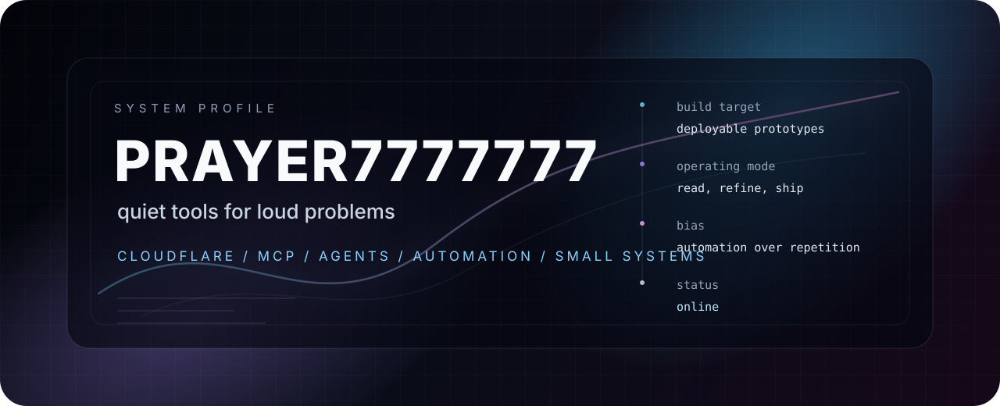

  

  
  
  

---

## Hello

Hi, I am **prayer7777777**.

I use GitHub as a workshop for practical experiments: cloud tools, automation, small AI services, personal sites, Android utilities, and research-style prototypes. I prefer projects that are useful enough to run, simple enough to understand, and documented enough to revisit later.

<table>
  <tr>
    <td><strong>Focus</strong></td>
    <td>Cloudflare Workers, MCP servers, automation, AI tooling</td>
  </tr>
  <tr>
    <td><strong>Style</strong></td>
    <td>Pragmatic prototypes, readable docs, deployable demos</td>
  </tr>
  <tr>
    <td><strong>Now</strong></td>
    <td>Polishing repos, learning by building, keeping notes public</td>
  </tr>
</table>

## Principles

<table>
  <tr>
    <td width="33%"><strong>Ship small</strong> Keep ideas runnable before they become complicated.</td>
    <td width="33%"><strong>Document early</strong> Leave enough context for the next session to resume fast.</td>
    <td width="33%"><strong>Automate boring work</strong> Use scripts, workflows, and agents where they reduce friction.</td>
  </tr>
</table>

## Featured Work

<table>
  <tr>
    <td width="50%">
      <h3><a href="https://github.com/prayer7777777/GrokSearch">GrokSearch</a></h3>
      
Remote MCP / search tooling experiments around Cloudflare Workers and AI-assisted workflows.

      
 

    </td>
    <td width="50%">
      <h3><a href="https://github.com/prayer7777777/model-council">model-council</a></h3>
      
Model comparison and council-style reasoning experiments.

      
 

    </td>
  </tr>
  <tr>
    <td width="50%">
      <h3><a href="https://github.com/prayer7777777/cloud-mail">cloud-mail</a></h3>
      
Cloud email utilities and service-side experiments.

      
 

    </td>
    <td width="50%">
      <h3><a href="https://github.com/prayer7777777/newapi-mcp">newapi-mcp</a></h3>
      
MCP wrapper experiments for New API style services.

      
 

    </td>
  </tr>
</table>

  
<strong>More repositories I keep around</strong>

   

  - <a href="https://github.com/prayer7777777/CLIProxyAPI">CLIProxyAPI</a> - API proxy experiments for command-line model tools.
  - <a href="https://github.com/prayer7777777/hermes-agent">hermes-agent</a> - agent workflow experiments.
  - <a href="https://github.com/prayer7777777/CloudFlare-ImgBed">CloudFlare-ImgBed</a> - image hosting on Cloudflare.
  - <a href="https://github.com/prayer7777777/PyImpact-Insight">PyImpact-Insight</a> - Python analysis and impact exploration.

## Toolbox

  

## GitHub Stats

  

  
  

## Activity

  <picture>
    <source media="(prefers-color-scheme: dark)" srcset="https://raw.githubusercontent.com/prayer7777777/prayer7777777/output/github-contribution-grid-snake-dark.svg" />
    <source media="(prefers-color-scheme: light)" srcset="https://raw.githubusercontent.com/prayer7777777/prayer7777777/output/github-contribution-grid-snake.svg" />
    
  </picture>

---

  Built with curiosity, kept tidy with Git.

